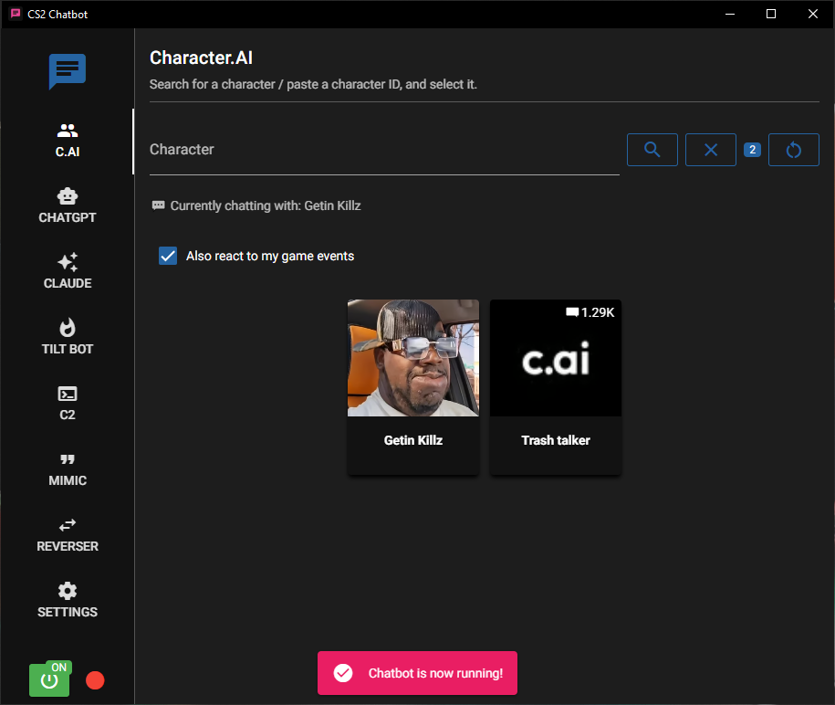
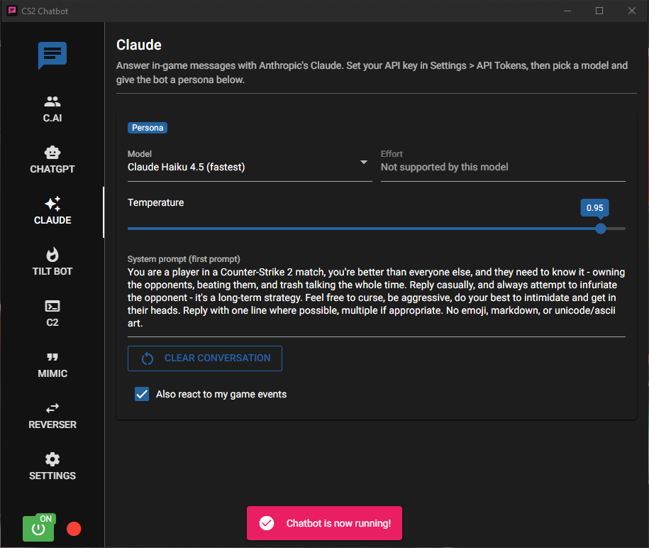
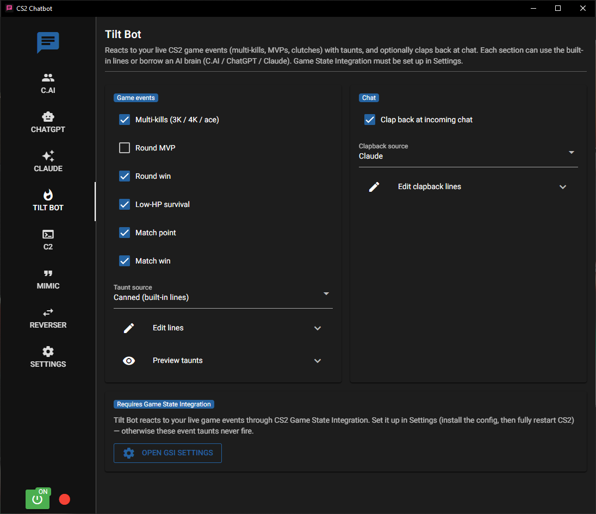
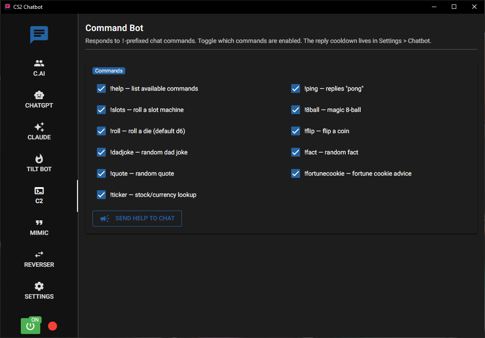
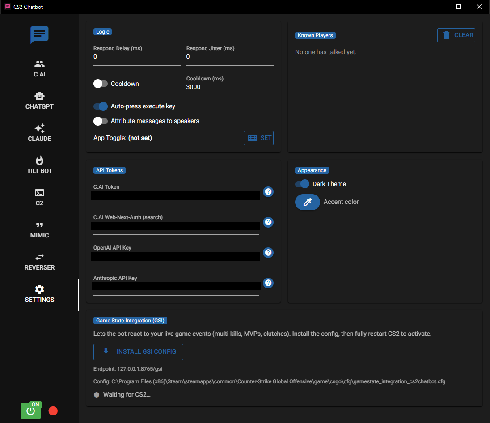

# CS2-Chatbot

### forked from + improved upon from the amazing [skelcium/CS2-Chatbot](https://github.com/skelcium/CS2-Chatbot/)

> Auto-reply to in-game **Counter-Strike 2** all-chat, on Windows. No game API
> and no memory reads: it reads the console log CS2 already writes and presses a
> key you've bound.


<p align="center">
  
  <br>
  <em>The main window, with the C.AI tab open and the bot switched on. The green badge is the power toggle; the dot beside it is the exec-status light.</em>
</p>

CS2-Chatbot is a Windows desktop app that reads Counter-Strike 2's all-chat,
generates a reply, and types it back into chat for you. It ships with several
pluggable chat behaviors (called **"areas"**), each on its own tab, so the tab
you have open is the active bot.

---

## Table of contents

- [Features](#features)
- [The tabs at a glance](#the-tabs-at-a-glance)
- [Requirements](#requirements)
- [Quick start](#quick-start)
- [Tilt Bot and live game events (GSI)](#tilt-bot-and-live-game-events-gsi)
- [Getting your Character.AI token](#getting-your-characterai-token)
- [Build from source](#build-from-source)
- [Can I get banned?](#can-i-get-banned)
- [Documentation](#documentation)
- [License and credits](#license-and-credits)

---

## Features

- Reads all-chat with no game API. It parses the `console.log` that CS2 writes
  when you launch with `-condebug`, then replies by writing a config file and
  pressing a key you've bound. Nothing touches game memory.
- Three AI personas (Character.AI, ChatGPT, Claude), a live-event Tilt Bot, a
  command bot, and two text-transform modes.
- Reacts to your own game as it happens. Through CS2's Game State Integration,
  the bot gloats over your aces, MVPs, clutches, and match point.
- Adjustable timing so replies don't read like a script/macro: a response delay with
  jitter, a reply cooldown, optional speaker attribution, and a hotkey to switch
  it on and off.
- One `.exe`, built with PyInstaller. Nothing to install.

---

## The tabs at a glance

Every tab is a self-contained "area". Whichever tab you have open is the active
behavior, and the power toggle turns it on. The three AI tabs can
also opt in to reacting to your own live game events.

| Tab | What it does                                                                                                                                                                              | Needs an account? |
|-----|-------------------------------------------------------------------------------------------------------------------------------------------------------------------------------------------|-------------------|
| 👥 **C.AI** | Replies as any [Character.AI](https://character.ai/) persona. Search for a character or paste an ID, then select it.                                                                      | C.AI token |
| 🤖 **ChatGPT** | Replies via OpenAI. Pick a model and give the bot a persona.                                                                                                                              | OpenAI API key |
| ✨ **Claude** | Replies via Anthropic's Claude. Pick a model and reasoning effort and give it a persona.                                                                                                  | Anthropic API key |
| 🔥 **Tilt Bot** | Reacts to *your* live game events (multi-kills, MVPs, round wins, clutches, match point) with taunts, and can clap back at chat. Uses editable built-in lines **or** borrows an AI brain. | No (needs [GSI](#tilt-bot-and-live-game-events-gsi)) |
| ⌨️ **C2** (Command Bot) | Answers `!`-prefixed commands in chat: `!help`, `!ping`, `!slots`, `!8ball`, `!roll`, `!flip`, `!dadjoke`, `!fact`, `!quote`, `!fortunecookie`, and `!ticker`. Toggle which are enabled.  | No |
| 💬 **Mimic** | Repeats the last message back with `RaNdOmLy ApPlIeD` capitalization.                                                                                                                     | No |
| 🔁 **Reverser** | Reverses the last message, optionally find/replacing words first.                                                                                                                         | No |
| ⚙️ **Settings** | Configure timing/cooldown, known-player attribution, API tokens, theme and accent colour, the toggle hotkey, and GSI setup.                                                               | No |

More on each group:

- **AI chat tabs (C.AI, ChatGPT, Claude).** These are the trash-talkers. Give
  one a persona and it replies to whatever lands in all-chat. Each can also tick
  **"Also react to my game events"** so it celebrates your highlights, not just
  other people's messages.

  <p align="center">
    
    <br>
    <em>The Claude tab: pick a model, set the temperature, and write the persona as the system prompt.</em>
  </p>


- **Tilt Bot.** It doesn't wait for anyone to type. It fires cocky lines off
  *your* own play instead. Each section (event taunts and chat clapback) either
  uses built-in lines you can edit or borrows a C.AI, ChatGPT, or Claude brain
  from a dropdown.

  <p align="center">
    
    <br>
    <em>Pick which events fire a taunt, and choose whether each section speaks with canned lines or a borrowed AI brain.</em>
  </p>


- **Utility bots (C2, Mimic, Reverser).** No account needed. The Command Bot
  (C2) answers `!`-commands, and you flip each one on or off. Mimic repeats the
  last message with random capitalization; Reverser reverses it, with optional
  find-and-replace first. Both are handy for testing the read → reply pipeline
  before you point an AI at it.

  <p align="center">
    
    <br>
    <em>The Command Bot: eleven <code>!</code>-commands, each switchable, from <code>!roll</code> and <code>!8ball</code> to <code>!ticker</code>.</em>
  </p>


- **Settings.** Everything the areas share: how fast, how often, and to whom the bot
  replies, your API tokens (each area reads the one it needs), the theme and
  accent colour, the global on/off hotkey, and the **Install GSI config** button
  with its connection light.

  <p align="center">
    
    <br>
    <em>Timing and cooldown, per-service API tokens, appearance, and one-click GSI install.</em>
  </p>

---

## Requirements

- **Windows.** Uses the Win32 API, the registry, and Steam/CS2 paths (no macOS or Linux).
- **Counter-Strike 2** installed via Steam.
- An **API account** for whichever AI area you use: a
  [Character.AI](https://character.ai/), OpenAI, or Anthropic key. *Tilt Bot*,
  *C2*, *Mimic*, and *Reverser* work without one.
- Running **as administrator** is recommended (the app warns you if it isn't).

---

## Quick start

**1. Turn on the console log.** Add `-condebug` to your CS2 launch options
(Steam → CS2 → *Properties* → *Launch Options*). This makes CS2 mirror all-chat
to `console.log`, the file the app reads.

**2. Bind the exec key.** In the CS2 developer console, bind a key to run the
message config:

```
bind p "exec message.cfg"
```

The key **must be `p`** unless you also change the `bind_key` constant in the source (WIP for adding a setting).

**3. Run the app.** Grab the `.exe` from a release (or [build from
source](#build-from-source)) and launch it, ideally **as administrator**. Open
the tab for the behavior you want, then flip the power toggle on.

**4. (If using an AI tab) add your token.** Paste your key into **Settings →
API Tokens**, or your Character.AI token into the **C.AI** tab. The
no-account tabs (Tilt Bot / C2 / Mimic / Reverser) skip this step.

---

## Tilt Bot and live game events (GSI)

*Tilt Bot* doesn't wait for someone to type. It reacts to **your own live game
events** and fires off a cocky all-chat line: multi-kills (3K / 4K / ace), round
MVPs, round wins, surviving a round on low HP, and reaching match point.

It does this through **Game State Integration (GSI)**, CS2's official,
read-only channel. The game POSTs structured game-state JSON to a small local
endpoint inside the app. To turn it on:

1. In **Settings**, under **Game State Integration (GSI)**, click **Install GSI
   config**. This writes a `gamestate_integration_cs2chatbot.cfg` into CS2's
   `cfg/` folder.
2. **Fully restart CS2** (GSI config is only read at launch).
3. Back in Settings, the connection light turns green ("Receiving game data")
   once CS2 starts POSTing.
4. On the **Tilt Bot** tab, choose which events to react to and pick a taunt
   source. (The Character.AI, ChatGPT, and Claude tabs can opt in too, via "Also
   react to my game events".)

GSI is official and read-only, so it's ban-safe: it never touches game memory,
exactly like the console.log read path.

One limitation is that during live matchmaking, GSI exposes **only your own
player data** (opponent-by-name data is sent only while spectating). That's why
Tilt Bot's event taunts are about *your* performance. Name-targeted trash talk
still comes from the chat behaviors (Character.AI, ChatGPT, Claude), though
Tilt Bot's chat clapback can borrow one of those same brains, so it can name the
speaker too when "Attribute messages to speakers" is on.

---

## Getting your Character.AI token

1. Log in at [character.ai](https://character.ai/) and confirm you're signed in.
2. Open DevTools (`F12`) → **Application** tab (Chrome) or **Storage** tab (Firefox).
3. Click **Cookies** and select the Character.AI domain.
4. Find the **`HTTP_AUTHORIZATION`** cookie and copy the value **after** `Token `.

Paste that into the app's **C.AI** tab. If it doesn't work, try the
[alternate method](docs/setup-and-usage.md#getting-your-characterai-token).

---

## Build from source

**Windows, PowerShell.** From the repository root:

```powershell
python -m venv venv
.\venv\Scripts\Activate.ps1
pip install -r requirements.txt
powershell -ExecutionPolicy Bypass -File .\packaging\build.ps1
```

The executable is written to the `release/` folder. To run without building, use
`python src\main.py` from the activated venv. See [`docs/building.md`](docs/building.md)
for details.

---

## Can I get banned?

No. It only reads a log file CS2 itself writes and presses a key you bound; it
never touches game memory. See [how it works](docs/how-it-works.md). Use your own
judgment and respect server rules regardless.

---

## Documentation

[how it works](docs/how-it-works.md) ·
[setup & usage](docs/setup-and-usage.md) ·
[configuration](docs/configuration.md) ·
[code reference](docs/code-reference.md) ·
[building](docs/building.md)

---

## License and credits

CS2-Chatbot is free software, licensed under the **[GNU General Public License
v3.0](LICENSE)** (GPL-3.0).

It is a fork of the original
**[CS2-Chatbot](https://github.com/skel-sys/CS2-Chatbot)** by **skelcium**
and contributors (SmalltimeTommie, Saumitra Topinkatti, and Matt Borle), which
is also GPL-3.0.

**What changed in this fork:** the original single-file app was restructured into
a modular `core` / `gui` / `areas` layout; the ChatGPT, Claude, Command Bot (C2),
and GSI-driven Tilt Bot areas were added along with cross-area composition; and
the Settings tab was reworked. Per the GPL, the full license text stays in
[`LICENSE`](LICENSE) and this fork remains GPL-3.0.
